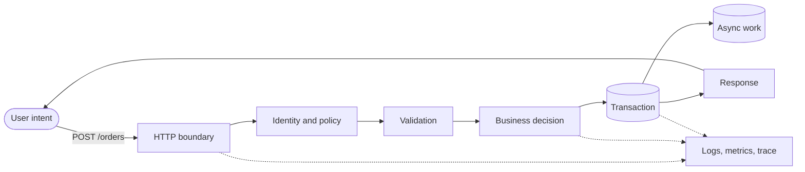

I could ship a screen before I could explain where the POST went.

That is not a flex. For a long time my loop looked like this: open Figma, build the form, wire `fetch`, pray the status code is 200, move on. The UI looked finished. The system was a rumor.

Then I built features that had to survive contact with reality.

A webhook arrived twice. A request timed out after the database had already committed. A user was authenticated but not authorized. Two tabs submitted the same form. The logs said “something went wrong,” which was technically true and operationally useless.

None of these failures cared how polished the loading state was.

That is where the backend stopped looking like a collection of routes and started looking like the place where the product keeps its promises. Create this order once. Never show one user's data to another. Preserve the money even if the network disappears halfway through. If something fails, leave enough evidence to explain why.

Backend first, for me, is not “skip the frontend.” It is an order of curiosity. Before I decorate a view, I want to walk with the request — from the browser to the handler to the row in the database and back. If I cannot tell that story, I do not actually know the feature. I only know the costume.

<Callout tone="idea" title="The principle">
  Follow one request from intention to durable outcome. Name every boundary,
  protect every promise, and make every failure explainable.
</Callout>

## The request is the curriculum

Backend learning is usually presented as a shopping list: Node, Express, Postgres, Redis, Docker, Kafka, Kubernetes. The logos change; the anxiety does not. You can finish ten tutorials and still freeze when production returns a 502.

The problem is not the list. It is that the list has no cause and effect.

A request gives the list a plot. Take something ordinary: `POST /orders`. A person clicks once and expects one order to exist. That sentence already contains most of the backend.

The server has to understand the request, identify the person, reject malformed input, check business rules, write consistent state, handle a retry, trigger work that can happen later, return a useful response, and leave a trace. HTTP, auth, validation, databases, transactions, idempotency, queues, error handling, and observability are no longer disconnected topics. They are stops on one trip.

<WritingMermaid
  title="One request, end to end"
  caption="The exact technologies can change. The responsibilities remain: establish identity, validate intent, protect the invariant, persist the result, and leave evidence."
>

</WritingMermaid>

When I am new to a framework, I do not begin by memorizing its directory tree. I ask how one request enters, where it is parsed, how dependencies reach the handler, where a transaction begins, how errors become responses, and where logs go. Once I can trace that path, the framework becomes vocabulary instead of magic.

## A backend is a set of promises

The happy path is easy to overvalue because it photographs well. Send valid JSON, receive `201 Created`, put the screenshot in the README.

Production begins with the second request.

What if the client retries because it never received the first response? What if two requests update the same balance? What if the email provider is down after the order commits? What if the process dies between those two operations? What if the token is real but belongs to the wrong organization?

These are not advanced edge cases added after “the backend” is complete. They reveal what the backend is responsible for.

I now try to name the promises before choosing the machinery:

- **Contract:** which inputs are accepted, and which outputs can a client rely on?
- **Identity:** who is making the request?
- **Policy:** are they allowed to do this to this resource?
- **Invariant:** what must remain true before and after the operation?
- **Durability:** when can I honestly tell the client the work succeeded?
- **Repeatability:** what happens when the same intention arrives twice?
- **Visibility:** how will I reconstruct the operation when it fails?

Once those are clear, technology choices get smaller. A transaction protects an invariant. An idempotency key protects a repeated intention. A queue separates durable work from work that may finish later. A trace connects evidence across boundaries.

Without the promise, those tools are résumé decoration.

<Callout tone="warning" title="A status code is not proof">
  Returning `200` proves that the handler reached a line of code. It does not
  prove that the right user changed the right state exactly once.
</Callout>

## Learn with one thin slice

I used to build horizontally. First all routes, then all models, then authentication, then tests if the project still had oxygen. That produces a wide skeleton with no living path through it.

Now I build one thin vertical slice.

Choose a use case small enough to hold in your head but real enough to have consequences. “Create a note” is better than a todo list if notes belong to users. “Reserve a seat” is better if you want concurrency to matter. “Accept a payment webhook” is better if you want retries and signatures to become unavoidable.

Then take one operation all the way through:

1. Write the request and response contract.
2. Validate untrusted input at the boundary.
3. Authenticate the caller and authorize the resource.
4. Put the business decision somewhere you can name and test.
5. Persist it in a real database.
6. Return an error shape a client can act on.
7. Record enough context to find the request later.
8. Test through the public boundary.

That is already a backend. Small, incomplete, and honest.

Only then do I add a second operation. Reading the resource exposes query design. Updating it exposes partial validation and concurrency. Deleting it exposes ownership, retention, and whether “delete” actually means delete. The project grows by earning questions.

This is slower than copying a complete starter in the first hour. It is much faster than reaching hour twenty with a system whose failures you cannot explain.

## Break it before a user does

The most useful backend lessons begin after the endpoint works.

Send an empty body. Send the wrong content type. Remove the token. Use a valid token for another user's resource. Submit the same idempotency key twice. Kill the database connection. Make the downstream provider wait longer than your timeout. Start two updates against the same row.

For each failure, ask four questions:

1. What did the client receive?
2. What state was left behind?
3. What evidence did the server record?
4. Is retrying safe?

Those questions turn vague “error handling” into design.

A malformed request should fail before business logic runs. An unauthorized request should reveal as little as possible. A database failure should not leave half an operation committed. A retryable dependency failure should not become five immediate retries from every instance. A log should include a request identifier and useful context without leaking a password, token, or private payload.

This is how I learned that reliability is not one module at the end. It is a habit of asking what remains true when the next line does not execute.

## The roadmap has eight doors

I learned this the hard way. Open source backends made it obvious — the good ones read like a path, not a pile. Shipping this site's APIs, and later the messier insides of real products, made it personal. A pretty empty state does not help at 1am when a webhook fired twice and charged someone twice.

So I stopped “learning backend” as a vibe and gave it a spine. Eight modules. The same walk whenever I am new to a stack, or lost in one I thought I knew.

<BackendRoadmap />

## How I walk it

I do not finish module eight before writing a line of code. That would turn the roadmap into school. I use it as a set of doors around the same request.

Foundations come first because every abstraction eventually leaks HTTP, networking, or process behavior. Then I take one use case and drag it through data flow, a small API, a real database, one auth check, one log line, and one test.

After that, the next module is chosen by pressure.

If the query is slow, I inspect it before installing Redis. If background work blocks the response, I learn a queue. If two writes conflict, I learn transactions and concurrency. If a deployment loses requests, I learn graceful shutdown. If I cannot explain a production failure, I improve observability before adding another feature.

Scaling waits until something has a measured reason to scale. Email waits until a user needs a message. Docker waits until environment drift becomes a problem worth solving. Microservices wait a very long time.

The roadmap is a map, not a prison. It helps me see the territory without pretending every project must visit every landmark.

<Callout tone="note" title="A loop that works">
  Learn enough foundation to trace one request → ship one thin slice → break it
  deliberately → study the module that explains the failure → repeat.
</Callout>

## What I deliberately postpone

Backend content has a complexity problem. The most dramatic tools are often taught before the ordinary system they are supposed to improve.

I postpone microservices until independently deploying or scaling a boundary solves a real organizational or runtime constraint. I postpone caches until I can identify the slow query and define acceptable staleness. I postpone event-driven architecture until asynchronous ownership is clearer than a direct call. I postpone a generic repository layer until there are multiple storage concerns worth hiding.

This is not an argument against advanced systems. It is an argument for meeting them with a question.

Redis is interesting when you know why the database is not enough. Kafka is interesting when you have events, consumers, ordering requirements, and failure modes to reason about. Kubernetes is interesting when operating many processes is already your problem. Before that, the tool can hide the lesson it was meant to teach.

The backend-first principle is not technology-first. It is consequence-first.

## The frontend gets better too

Frontend is still how people touch the product. I care deeply about that. I just refuse to let the interface be the only part I can explain.

Understanding the request path changes how I build the UI. Loading is no longer a boolean sprinkled around a button; it represents work with a lifecycle. An error message comes from a contract, not a guessed string. Optimistic updates depend on whether reversal is possible. A disabled submit button is helpful, but idempotency still belongs on the server. Authentication in a client can improve the experience, but authorization must survive a direct HTTP request.

Backend first does not put the server above the interface. It lets both sides meet at an honest boundary.

I know I understand a feature when I can answer:

- Who initiated this request?
- What did we trust, and what did we verify?
- Which business rule made the decision?
- What state changed, and was the change atomic?
- What happens if the request arrives again?
- What does the client receive when each dependency fails?
- How will I find this exact operation tomorrow?

If the request can tell that story, I have learned enough backend for today.

Tomorrow there is another failure mode. There always is.

Still learning. Still growing. Still here.

[**@chahatkesh**](/)
